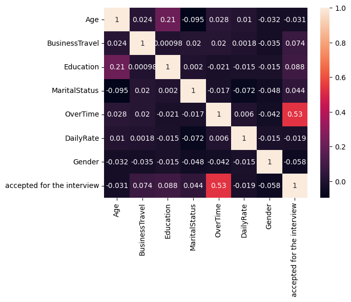

# Pre-Interview Assessment

## Training and evaluating different machine learning models for pre-interview assessment.

The code was written in jupyter notebook and can be run in jupyter notebook.

### Data pre-processing

The dataset consists of 9 columns. The field EmployeeNumber wwas dropped, as it had no use for the model. Textual values (BusinessTravel, MaritalStatus, OverTime, Gender) were converted to numbers using the OrdinalEncoder function. Numerical values (Age, Education, DailyRate) were standardized with the StandardScaler function.

### Data visualization
A correlation heatmap was drawn with the pre-processed data, to visualize the data, before training the model.
<div style="text-align:center;">

</div>
Overtime field showed correlation with the accepted for the interview field. Age and Education also showed small correlation.

### Used models and evaluations
Three models were used: Logistic Regression, Naive Bayes and K-Nearest Neighbors. For the KNN algorithm, several k values were tested, however the value k=5 gave the most accurate result. Models were scored, classification report and the confusion matrix were printed.
#### Logistic Regression
```
Logistic Regression Metrics
Score:  0.9063545150501672
Report: 
               precision    recall  f1-score   support

           0       0.93      0.97      0.95       268
           1       0.59      0.32      0.42        31

    accuracy                           0.91       299
   macro avg       0.76      0.65      0.68       299
weighted avg       0.89      0.91      0.89       299

Confusion matrix: 
 [[261   7]
 [ 21  10]]
```
#### Naive Bayes
```
Naive Bayes Metrics
Score:  0.8662207357859532
Report: 
               precision    recall  f1-score   support

           0       1.00      0.85      0.92       268
           1       0.43      0.97      0.60        31

    accuracy                           0.87       299
   macro avg       0.72      0.91      0.76       299
weighted avg       0.94      0.87      0.89       299

Confusion matrix: 
 [[229  39]
 [  1  30]]
```
#### K-Nearest Neighbors
```
K-Nearest Neighbors Metrics
Score:  0.9765886287625418
Report: 
               precision    recall  f1-score   support

           0       0.98      1.00      0.99       268
           1       0.96      0.81      0.88        31

    accuracy                           0.98       299
   macro avg       0.97      0.90      0.93       299
weighted avg       0.98      0.98      0.98       299

Confusion matrix: 
 [[267   1]
 [  6  25]]
```

Overall the K-Nearest Neighbors algorithm worked the best for the given dataset, with an accuracy of 98%, while Naive Bayes got an accuracy of 87% and Logistic Regression got an accuracy of 91%.

From the confusion matricies it is clear that K-Nearest Neighbors had the lowest false-positives and false-negatives, while Naive Bayes had more false-positives, and Logistic Regression had mode false-negatives.